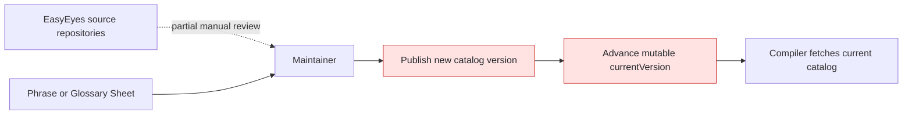
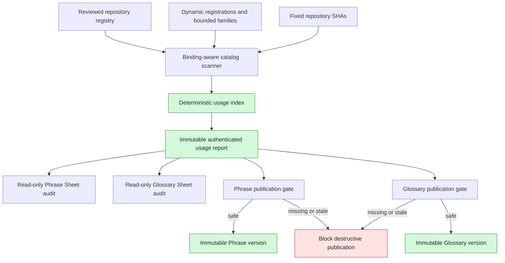
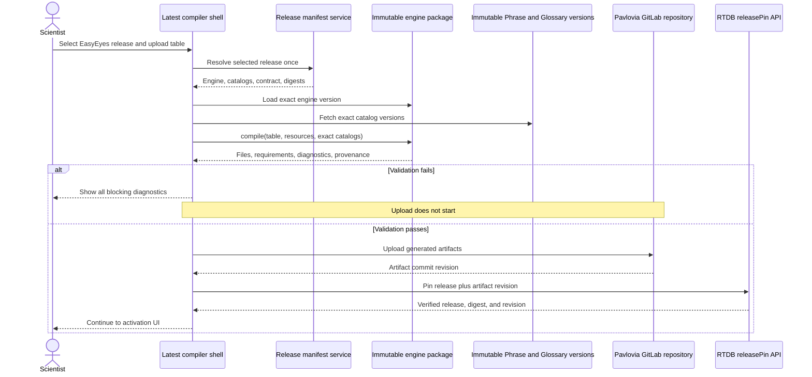
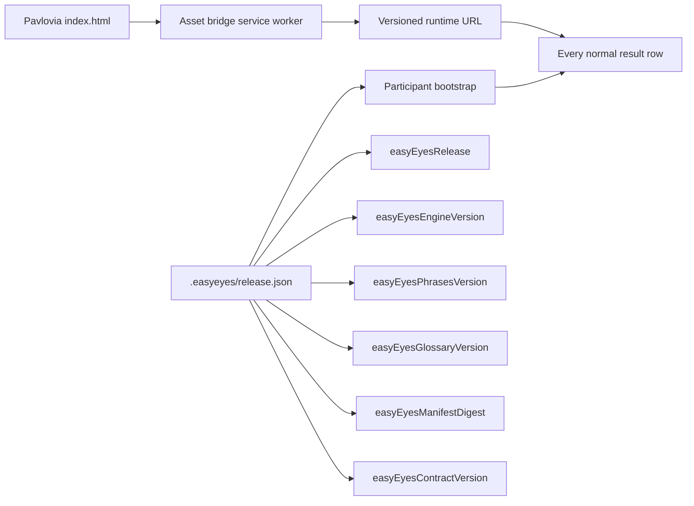
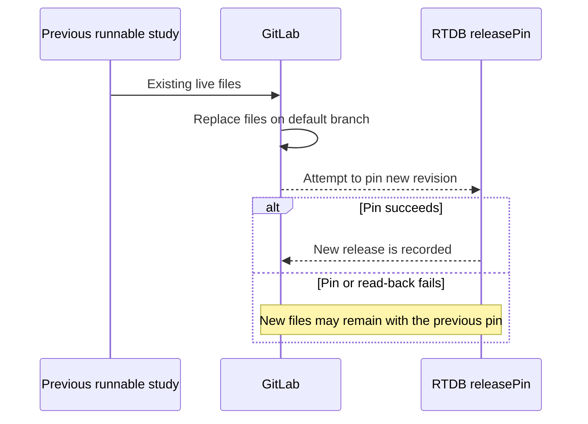

# Catalog governance and experiment versioning guide

This guide explains how catalog publication, experiment compilation, runtime
selection, and result provenance changed on
`feature/catalog-usage-governance`. It also describes how to test the changes.

The implementation follows
`tasks/catalog-and-experiment-versioning-plan-v1.md` in the EasyEyes workspace.
The 12 organization repositories outside the current priority scope are
deferred. Their unknown usage remains uncertainty and is never evidence that a
Phrase or Glossary definition is safe to delete.

## Summary

The old implementation selected several mutable versions independently. A
compiler could read the current Phrase catalog, current Glossary, and current
runtime at different times. A study therefore had no single identity that
described all code and catalog data used to compile and run it.

The new implementation introduces a dated, immutable EasyEyes release. One
release manifest binds an engine package, Phrase catalog, Glossary, contract
version, integrity values, and the catalog-usage report that approved the
catalogs. Compilation resolves this manifest once and carries the selected
tuple through validation and artifact generation. After upload, one RTDB
`releasePin` records the selected release and GitLab artifact revision.

## Catalog governance: old and new

### Old catalog publication

Catalog maintainers could publish a new Phrase or Glossary version without a
complete, shared inventory of source-code usage. Separate tools could interpret
dynamic references differently, and there was no immutable report connecting a
publication decision to fixed repository revisions.



Main limitations:

- Source usage was not consistently resolved at fixed Git SHAs.
- Dynamic readers and numbered families such as `questionAndAnswerNN` could be
  missed or classified inconsistently.
- Phrase and Glossary audits did not share one comparison contract.
- An unused-looking definition could be removed without reliable evidence.
- Publication was not bound to a content-addressed audit report.

### New catalog publication



The scanner now distinguishes exact references, aliases, bounded patterns,
registered dynamic references, and unresolved uncertainty. Missing used
definitions block publication. Unused candidates and uncertain references are
advisory and never trigger automatic deletion.

Report content is deterministic for fixed inputs. Generation time and freshness
are publication metadata, so they do not change the report's content identity.

## Experiment versioning: old and new

### Old compile and runtime flow

```mermaid
sequenceDiagram
    actor Scientist
    participant Compiler as Latest compiler
    participant Phrase as Phrase currentVersion
    participant Glossary as Glossary currentVersion
    participant Repo as Pavlovia experiment repo
    participant Participant

    Scientist->>Compiler: Upload experiment table
    Compiler->>Phrase: Fetch current Phrase data
    Compiler->>Glossary: Fetch current Glossary data
    Compiler->>Compiler: Compile with bundled current code
    Compiler->>Repo: Copy runtime and generated files
    Participant->>Repo: Run copied bundle

    Note over Compiler,Glossary: Mutable pointers can change independently
    Note over Repo,Participant: Results do not contain one complete release tuple
```

The old flow had separate `phrasesVersion` and `glossaryVersion` records. They
could be written sequentially, which allowed split state if one write failed.
Recompiling the same table later could also use a different compiler, runtime,
or catalog combination.

### New compile and activation flow



Important differences:

- A new experiment has one authoritative `releasePin`, not independently
  selected Phrase and Glossary pins.
- The manifest is immutable and identifies exact engine, Phrase, and Glossary
  artifacts with integrity metadata.
- The compiler preserves existing Parameter recognition and additionally builds
  deterministic study catalog requirements.
- Released Phrase keys and custom `~phrase` keys remain separate.
- Missing definitions prevent upload.
- The generated `.easyeyes/release.json` records release provenance in the
  experiment repository.
- Identical pin retries are idempotent and preserve the original `pinnedAt`.
- Pin reads and writes use the scientist's Pavlovia GitLab token. The endpoint
  verifies that the authenticated username matches the requested RTDB path.

## Runtime and results provenance



For a versioned study, participant startup loads and validates the provenance
file before normal data collection. The tuple is added to result data alongside
the existing PsychoJS version. A missing provenance file is treated as a legacy
experiment so existing copied bundles remain runnable. A present but malformed
file fails visibly with `RELEASE_COMPONENT_MISMATCH`.

When a scientist reopens a versioned experiment, the compiler reads its
authoritative RTDB pin and preselects that release. A legacy or new experiment
defaults to `latest`. If an existing experiment already has result CSV files,
changing its release requires explicit confirmation because the dataset will
span multiple EasyEyes versions.

## Current transactional limitation

The branch does not yet satisfy the final distributed-transaction invariant.
The current upload writes new files to the experiment's default GitLab branch
before writing `releasePin`:



The code prevents the compiler UI callback from activating after a pin failure,
but it cannot guarantee that an already-running Pavlovia project continues to
serve the previous files. The final design needs an inactive revision or a
stable bootstrap that resolves artifacts by the pinned Git revision. Runtime
integrity must then compare the authoritative pin, immutable manifest, artifact
revision, and downloaded component digests before data collection.

This limitation must remain visible in rollout review. Do not describe the
current implementation as fully transactional until that architecture is
implemented and fault-tested.

## How to test

Run commands from each owning repository. Do not reset or modify the existing
`threshold/psychojs` working-tree change.

### 1. Website catalog and release services

```bash
cd website
npm install
npm run test:catalog-audit
npm run test:catalog-report
npm run test:release-manifest
npm run test:compiler-cache
```

Expected results:

- Scanner fixtures pass, including binding shadowing, aliases, dynamic
  registrations, `catalogKinds`, and `questionAndAnswerNN` families.
- Fixed inputs serialize to identical report bytes.
- Missing definitions and stale reports block catalog publication.
- Unauthorized, oversized, conflicting, and partial report writes fail.
- Immutable release replay succeeds only for identical content.
- Pin authorization rejects missing tokens and mismatched GitLab usernames.
- Pin read-back returns the same release, manifest digest, and artifact
  revision.

### 2. Threshold Scientist compiler shell

The freshness tests format dates for UTC. Set `TZ=UTC` for a deterministic full
suite.

```bash
cd website/docs/experiment
npm install
TZ=UTC npm test -- --runInBand
npm run check:ts
```

For a production build, provide the deployment identity expected by the Webpack
configuration:

```bash
DEPLOY_ID=test-release npm run build
```

Focused versioning tests can be run faster:

```bash
npm test -- --runInBand \
  source/__tests__/releaseManifestClient.test.js \
  source/__tests__/resolveEngine.test.js \
  source/__tests__/engineCompile.test.js \
  source/__tests__/Table.test.js \
  source/__tests__/App.test.js \
  source/__tests__/changeVersion.test.js
```

Verify that an invalid study reports diagnostics without populating upload
files. Verify that a successful compile emits `.easyeyes/release.json`, uses the
manifest-selected catalog versions, and defers pinning until GitLab returns a
commit revision.

### 3. Threshold participant runtime

```bash
cd website/docs/experiment/threshold
npm install
npm run check:ts
npm test -- --runInBand \
  tests/studyCatalogRequirements.test.ts \
  tests/releasePin.test.ts \
  tests/releaseProvenance.test.ts \
  tests/prepareRepo.test.ts
npm run build
```

The complete Threshold suite requires the repository's optional Rust/WASM and
font fixtures. Without them, related font tests fail before exercising this
feature. The focused tests above do not require those optional fixtures.

Confirm that `tests/prepareRepo.test.ts` proves a pin failure does not call the
activation callback. This is a UI boundary test, not proof that the live GitLab
default branch was preserved; see the transactional limitation above.

### 4. Versioned engine contract and parity

```bash
cd website/docs/experiment/threshold/threshold-engine
npm install
npm run verify
```

This builds the engine and runtime package, checks the frozen compile contract,
compares representative generated files byte-for-byte, validates resource
shapes and generated entry files, imports the package in a real browser, and
runs the referenced participant flow. Optional font/WASM checks may log that
they were skipped; the command must still exit successfully.

### 5. Release publication dry run

Create a schema-version 1 manifest containing real immutable component versions
and SHA-256 integrity values. Validate it without changing remote state:

```bash
cd website
npm run release:publish -- --dry-run path/to/release-manifest.json
```

For a non-production publication, set an isolated endpoint and secret:

```bash
RELEASE_MANIFEST_URL=https://example.test/.netlify/functions/release-manifest \
RELEASE_MANIFEST_SECRET='non-production-secret' \
npm run release:publish -- path/to/release-manifest.json
```

Verify all of the following:

1. The exact release lookup returns the manifest and `manifestDigest` with an
   immutable cache header.
2. `?latest` returns the same release with `cache-control: no-store`.
3. Republishing identical bytes is accepted and does not create a different
   manifest.
4. Republishing the same release ID with changed bytes returns
   `IMMUTABLE_RELEASE_CONFLICT`.
5. A stale catalog report or mismatched component digest prevents publication
   and does not move `latest`.

### 6. Manual compiler and participant matrix

Use non-production accounts and copies of representative studies:

| Scenario                      | Expected behavior                                                                                                                                                |
| ----------------------------- | ---------------------------------------------------------------------------------------------------------------------------------------------------------------- |
| New basic study               | Defaults to `latest`, compiles, uploads, and receives one RTDB pin.                                                                                              |
| Multilingual study            | Exact release Phrase languages validate and compile.                                                                                                             |
| Missing Phrase                | All missing Phrase diagnostics appear; no upload starts.                                                                                                         |
| Missing Parameter             | Existing Parameter recognition blocks compilation.                                                                                                               |
| Custom `~phrase`              | Remains separate from released Phrase keys and compiles when supplied.                                                                                           |
| Legacy study without a pin    | Reopens and runs through the legacy path; recompilation defaults to an approved release.                                                                         |
| Reopened versioned study      | The selector shows its RTDB-pinned release.                                                                                                                      |
| Study with collected CSV data | Selecting another release and recompiling shows a confirmation warning. Cancel leaves the study unchanged.                                                       |
| Pin API failure               | Compiler reports failure and does not continue to its activation callback. Also inspect the GitLab branch because full artifact rollback is not implemented yet. |
| Malformed provenance          | Participant startup fails visibly before normal data collection.                                                                                                 |

For a successful versioned run, download the result CSV and confirm these
columns contain the expected tuple:

```text
easyEyesRelease
easyEyesEngineVersion
easyEyesPhrasesVersion
easyEyesGlossaryVersion
easyEyesManifestDigest
easyEyesContractVersion
```

### 7. Read-only Sheets verification

Run both Apps Script menu audits against test copies of the Phrase and Glossary
Sheets. Compare their findings with the same immutable report downloaded from
CI. Confirm that:

- missing, unused, registered, and uncertain groups match CI;
- provenance, freshness, and source links are visible;
- malicious-looking source text is displayed as text, not executable HTML;
- no cells, versions, or catalog pointers change when an audit runs; and
- stale or unavailable reports produce an actionable error.

### 8. Security and rollback rehearsal

In a non-production environment:

1. Attempt report and manifest writes without a secret and with an incorrect
   secret. Both must return an authorization error.
2. Attempt pin reads and writes with no GitLab token, a token for another user,
   malformed path segments, a nonexistent release, and a wrong artifact
   revision. Each request must fail without replacing the previous pin.
3. Inspect function and browser logs. Tokens, shared secrets, report bodies, and
   catalog contents must not appear.
4. Move only the mutable `latest` pointer to a previous verified release.
   Confirm that existing experiment pins do not change and immutable manifests
   remain available.
5. Record the old and new pointer values, test results, screenshots, and
   maintainer approval in the pull request.

Production publication and rollback must wait until the transactional
limitation is resolved or explicitly accepted by maintainers.
