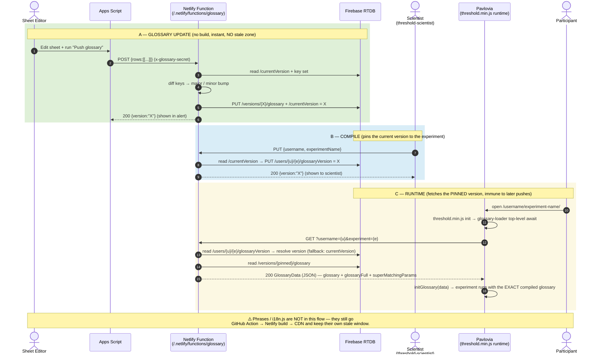
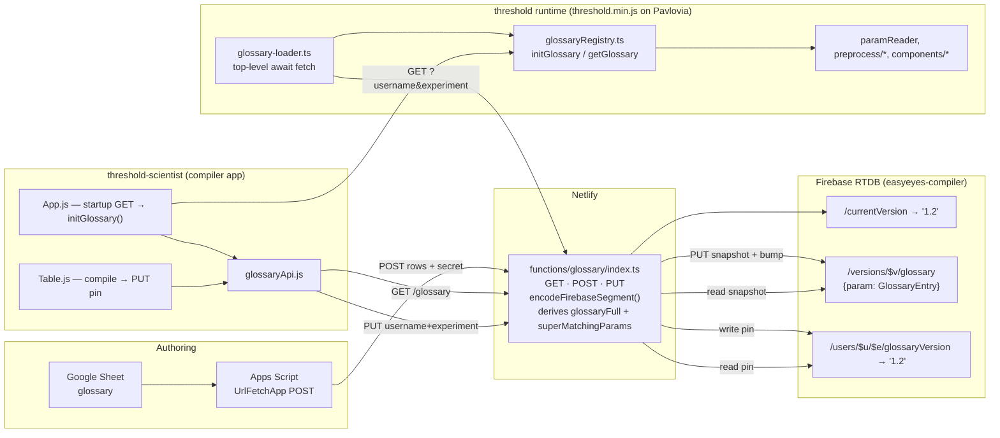
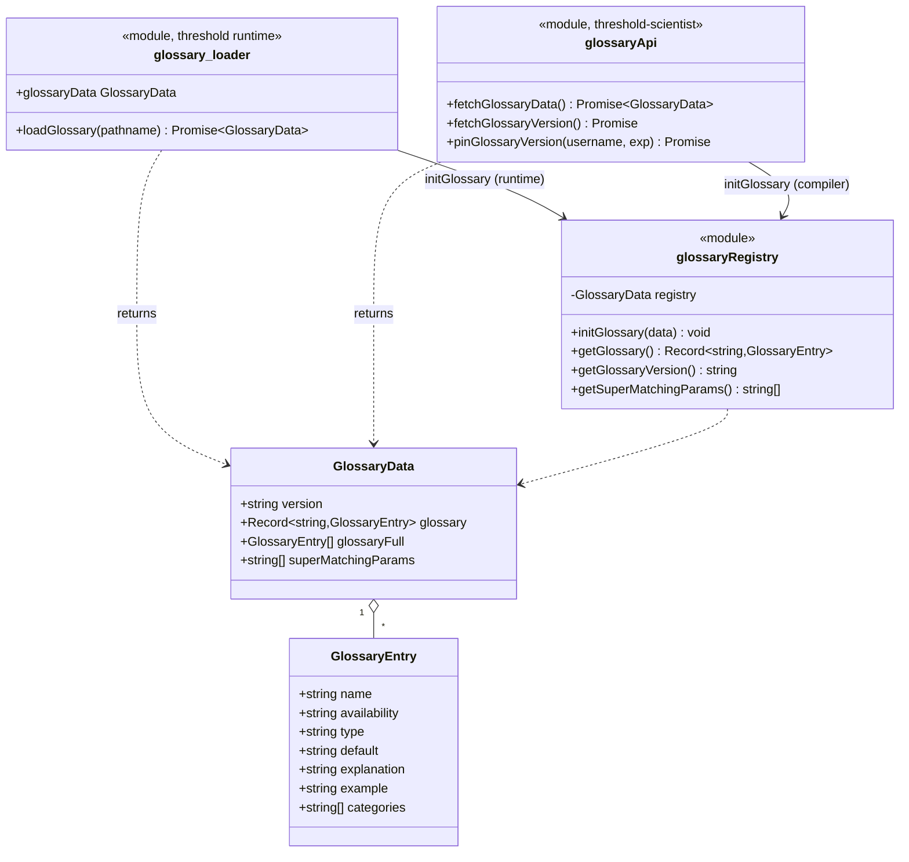
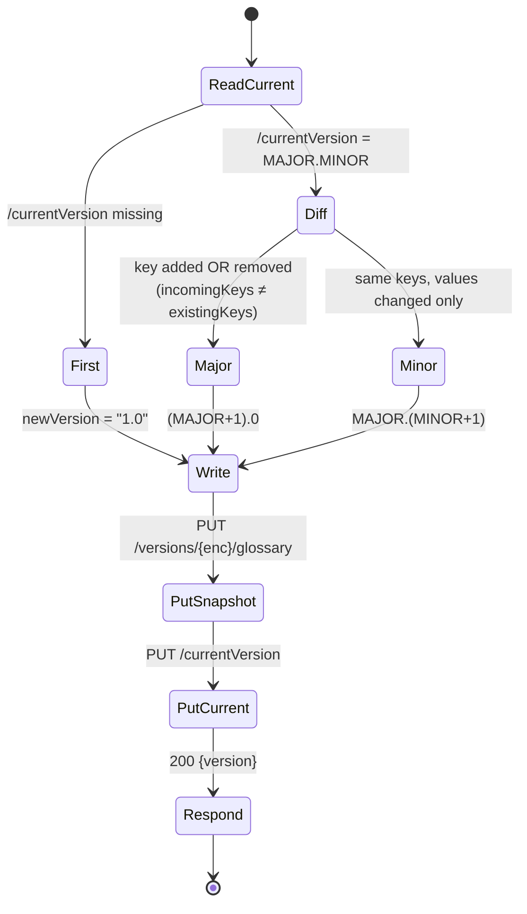

# Versioned Glossary API — New Architecture (Issue #87)

**Status:** Merged to `main` / `new-main` (29–30 May 2026)
**Branch:** `glossary-new-arch-2` across `website`, `threshold-scientist`, `threshold`
**Issue:** [EasyEyes/threshold-scientist#87](https://github.com/EasyEyes/threshold-scientist/issues/87)
**Audience:** EasyEyes dev team

> **Scope note.** This document covers the **glossary** only. The **phrases / i18n.js**
> pipeline (the `github action: update phrases` commits) is _not_ part of #87 and is
> unchanged — it still flows GitHub Action → commit → Netlify build → CDN, so it retains
> its own stale window (see [Stale Zone analysis](#5-stale-zone-the-headline-win-and-its-limit)).
>
> The **"old" baseline** in this comparison is the architecture in the reference sequence
> diagram: the glossary baked into `threshold.min.js` at build time via the generated
> `parameters/glossary.ts`. (Issue #77's never-deployed flat-snapshot variant is explicitly
> out of scope.)

---

## 1. TL;DR

The glossary used to be **compiled into the build artifact**. Changing a parameter meant
regenerating `glossary.ts`, committing it through the submodule chain, and waiting ~10–14
minutes for a Netlify build + CDN propagation. Worse, compiling an experiment _during_ that
window served the **previous** glossary (the "Stale Zone").

The new architecture makes the glossary **data, not code**:

- Glossary is stored as **versioned JSON snapshots in Firebase RTDB**, served by a Netlify
  function as `application/json` (never executable JS).
- A glossary content change is a **single POST to the Netlify function** — it writes a new
  versioned snapshot to Firebase **instantly, with no build**.
- Each compiled experiment **pins** the current glossary version against its Pavlovia path.
  At runtime, `glossary-loader.ts` fetches exactly that pinned version. Running experiments
  are therefore **immune to future glossary pushes**.

**Net effect:** the Stale Zone is _eliminated for glossary content_. A glossary update is
live the moment the POST returns; no experiment ever silently picks up a glossary it was not
compiled against.

---

## 2. Code changes by repository

### `threshold` (runtime + shared modules)

| File                                                                                                                                                                                                                                                                     | Change                                                                                      | Commit                             |
| ------------------------------------------------------------------------------------------------------------------------------------------------------------------------------------------------------------------------------------------------------------------------ | ------------------------------------------------------------------------------------------- | ---------------------------------- |
| `preprocess/glossary-loader.ts`                                                                                                                                                                                                                                          | **New.** Runtime fetch of pinned glossary via top-level `await`; exponential-backoff retry. | `247862d7`, `d2ddae31`, `48293bef` |
| `parameters/glossaryRegistry.ts`                                                                                                                                                                                                                                         | **New.** In-memory registry — single seam shared by runtime _and_ compiler.                 | `e1e05e6d`, `e76889f9`             |
| `components/easyeyesBaseUrl.ts`                                                                                                                                                                                                                                          | **New.** Resolves `localhost:8888` (netlify dev) vs `easyeyes.app`.                         | `48293bef`                         |
| `preprocess/retry.ts`                                                                                                                                                                                                                                                    | Backoff helper (`getRetryDelayMs`, `wait`).                                                 | `247862d7`                         |
| `threshold.js`                                                                                                                                                                                                                                                           | Imports `glossaryData` (top-level await) → `initGlossary(glossaryData)`.                    | `d2ddae31`                         |
| 14 consumer files (`paramReader.js`, `experimentFileChecks.ts`, `gitlabUtils.ts`, `main.ts`, `utils.js/ts`, `compatibilityCheck.js`, `shuffle.ts`, `fontCheck.ts`, `folderStructureCheck.ts`, `transformExperimentTable.ts`, `errorMessages.ts`, `useCalibration.js`, …) | Migrated from `import { GLOSSARY }` → `getGlossary()`.                                      | `36381b6e`                         |
| `parameters/glossary.ts`, `parameters/glossary-full.ts`                                                                                                                                                                                                                  | **Deleted (~11,381 lines).**                                                                | `2ca4f7e1`                         |

### `threshold-scientist` (compiler)

| File                               | Change                                                                                      | Commit                          |
| ---------------------------------- | ------------------------------------------------------------------------------------------- | ------------------------------- |
| `source/components/glossaryApi.js` | **New.** `fetchGlossaryData()`, `fetchGlossaryVersion()`, `pinGlossaryVersion()`.           | `833d2af`                       |
| `source/App.js`                    | On mount: `fetchGlossaryData()` → `initGlossary(data)`.                                     | `833d2af`, `fc1769f`            |
| `source/Table.js`                  | On file drop / compile: `pinGlossaryVersion(username, projectName)`.                        | `53f1f55`, `3a12f85`, `be3602a` |
| `source/components/types`          | Unified `GlossaryEntry` + `GlossaryData`.                                                   | `66bb1e9`                       |
| `database.rules.json`              | Public read for `/currentVersion`, `/versions/$v/glossary`, `/users/$u/$e/glossaryVersion`. | `f265820`                       |
| Apps Script                        | POSTs raw sheet rows to the Netlify function; shows returned version.                       | `886c538`, `4224aff`            |

### `website` (Netlify function + Firebase)

| File                                                  | Change                                                            | Commit                                         |
| ----------------------------------------------------- | ----------------------------------------------------------------- | ---------------------------------------------- |
| `netlify/functions/glossary/index.ts`                 | **New.** GET / POST / PUT handlers, server-side derivation, CORS. | `d875068d`, `c4d956ef`, `bcf0c18d`, `ad6a02d3` |
| `netlify/functions/glossary/encodeFirebaseSegment.ts` | **New.** One-way segment encoder/decoder.                         | `19e767e6`, `764f91c7`                         |

---

## 3. UML / architecture diagrams

### 3.1 Sequence — new architecture (compare against the old "Stale Zone" diagram)



### 3.2 Component / deployment



### 3.3 Class diagram — types + the registry seam



### 3.4 Version-bump auto-detection (POST handler)



---

## 4. API contract (`/.netlify/functions/glossary`)

| Method | Query / body                                      | Returns                                                                                                    | Used by                      |
| ------ | ------------------------------------------------- | ---------------------------------------------------------------------------------------------------------- | ---------------------------- |
| `GET`  | _(none)_                                          | `200` `GlossaryData` for current version                                                                   | threshold-scientist startup  |
| `GET`  | `?versionOnly=1`                                  | `200 {version}`                                                                                            | version display              |
| `GET`  | `?v=1.2`                                          | `200` `GlossaryData` for `1.2`, else `404`                                                                 | debugging / pinned reads     |
| `GET`  | `?username={u}&experiment={e}`                    | `200` `GlossaryData` for the **pinned** version; falls back to current if no pin; `404` if version missing | `glossary-loader.ts` runtime |
| `POST` | header `x-glossary-secret`; body `{rows:[[...]]}` | `200 {version}`; `401` bad secret; `400` bad body; `502` Firebase write failed                             | Apps Script                  |
| `PUT`  | `{username, experimentName}`                      | `200 {version}` (pins current); `400` bad body                                                             | threshold-scientist compile  |

**Server-side derivation (single source of truth):** `glossaryFull = Object.values(glossary)`
and `superMatchingParams = keys containing "@"` are computed by the GET handler — clients
never reimplement them.

**Firebase RTDB rules** (`database.rules.json`): root denies read/write; public read only on
`/currentVersion`, `/versions/$version/glossary`, and the single field
`/users/$username/$experimentName/glossaryVersion`. All writes go through the function using
the admin secret (`?auth=FIREBASE_DB`). The pin rule is scoped to the one field, so any future
per-user data under `/users/` stays private by default.

---

## 5. Stale Zone — the headline win, and its limit

### Old (build-baked glossary) — Stale Zone present

```
Action regenerates glossary.ts → commit (submodule chain) → Netlify build (~7–10 min)
→ regenerates threshold.min.js → deploy → CDN (~1 min).
Compiling DURING that window serves the PREVIOUS glossary → experiment runs with old params.
Total exposure: ~10–14 min per glossary change.
```

### New (versioned API) — Stale Zone eliminated **for glossary**

```
POST rows → Firebase write → live immediately. No build. No CDN wait.
Each experiment pins its version at compile time and fetches exactly that version at runtime.
A push that lands mid-compile cannot affect an already-compiled experiment.
```

> **The limit (be precise with the team):** #87 only removed the glossary from the build
> artifact. **Phrases / `i18n.js` still travel through GitHub Action → Netlify build → CDN**,
> so the Stale Zone in the reference diagram is _not fully closed_ — it is closed for the
> glossary lane only. The `i18n.js` lane is unchanged and remains a candidate for the same
> treatment. Also, `threshold.min.js` is still a build artifact: changes to the **loader code**
> (not glossary _content_) still require a build/deploy.

---

## 6. Pros & cons vs. the old build-baked glossary

### Pros

| #   | Benefit                                                                                                                                                        |
| --- | -------------------------------------------------------------------------------------------------------------------------------------------------------------- |
| 1   | **No build for glossary content.** A push is live on POST return (seconds), vs ~10–14 min.                                                                     |
| 2   | **Stale Zone eliminated for glossary.** Mid-build compiles can no longer serve old params.                                                                     |
| 3   | **Reproducibility / version pinning.** Each experiment runs the _exact_ glossary it compiled with; future pushes can't silently change running experiments.    |
| 4   | **Auto-versioning with semantics.** Major (key add/remove) vs minor (value-only) is detected server-side; first push is `1.0`. No human decides the number.    |
| 5   | **No remote-code execution.** Glossary is `application/json`, not JS run via `new Function(...)`. Removes that attack surface.                                 |
| 6   | **Single typed source of truth.** Unified `GlossaryEntry`/`GlossaryData`; `glossaryFull` + `superMatchingParams` derived server-side — no client drift.        |
| 7   | **~11,400 fewer generated lines in the repo;** one `glossaryRegistry` seam for both runtime and compiler.                                                      |
| 8   | **No per-experiment data in `index.html`.** Loader derives `username`/`experiment` from `window.location.pathname`; the version is read from Firebase by path. |

### Cons / risks

| #   | Risk                                                                                                                                                                                                                                                                                                                                                                | Notes |
| --- | ------------------------------------------------------------------------------------------------------------------------------------------------------------------------------------------------------------------------------------------------------------------------------------------------------------------------------------------------------------------- | ----- |
| 1   | **Runtime network dependency at bundle init.** The experiment now makes a blocking top-level-`await` fetch before it can run. Old build-baked glossary had zero runtime fetch.                                                                                                                                                                                      |
| 2   | **Retry loop is infinite — never fails loudly.** `glossary-loader.ts` uses `while (true)` with backoff `0.2 × 1.75^n` capped at 30 s. **This diverges from PRD user story 14** ("up to 10 s, then fail loudly"). A participant whose fetch keeps failing will **hang at startup forever** instead of seeing an error. Recommend adding a ceiling + visible failure. |
| 3   | **PUT pin has no auth.** Anyone can pin the _current_ version for any path (harmless given the fallback, per the PRD), but it is an open write endpoint. Tracked as future work.                                                                                                                                                                                    |
| 4   | **Two systems to operate** (Firebase + Netlify function) vs a static file — more moving parts, secrets (`FIREBASE_DB`, `GLOSSARY_SECRET`), and CORS to maintain.                                                                                                                                                                                                    |
| 5   | **Stale Zone only half-closed.** Phrases/`i18n.js` still use the build pipeline (§5).                                                                                                                                                                                                                                                                               |
| 6   | **Pin is best-effort, fire-and-forget.** `pinGlossaryVersion(...)` in `Table.js` is not awaited and only `console.warn`s on failure — a failed pin silently falls back to "current version" at runtime.                                                                                                                                                             |

---

## 7. How consumers use the new glossary

### 7.1 threshold runtime — already wired (`threshold.js`)

```ts
// preprocess/glossary-loader.ts already ran a top-level-await fetch by the time
// any other module imports glossaryData.
import { glossaryData } from "./preprocess/glossary-loader.ts";
import { initGlossary, getGlossary } from "./parameters/glossaryRegistry";

initGlossary(glossaryData); // call once, early in threshold.js
```

### 7.2 threshold-scientist compiler — already wired

```js
// App.js — populate the registry at app startup
import { fetchGlossaryData } from "./components/glossaryApi";
import { initGlossary } from "../threshold/parameters/glossaryRegistry";

const data = await fetchGlossaryData(); // GET /.netlify/functions/glossary
initGlossary(data);

// Table.js — pin the current version when an experiment compiles
import { pinGlossaryVersion } from "../threshold/parameters/glossaryRegistry";
const { version } = await pinGlossaryVersion(
  user.username,
  resolvedProjectName,
);
```

### 7.3 Reading the glossary anywhere downstream — the only pattern you need

```ts
import {
  getGlossary,
  getGlossaryVersion,
  getSuperMatchingParams,
} from "parameters/glossaryRegistry";

// OLD: import { GLOSSARY } from "../parameters/glossary";  ← deleted, do not use
const glossary = getGlossary(); // Record<string, GlossaryEntry>
const entry = glossary["targetEccentricityXDeg"];
const supers = getSuperMatchingParams(); // keys containing "@"
const version = getGlossaryVersion(); // e.g. "1.2" (or null pre-init)
```

> ⚠️ **Order matters.** `getGlossary()` / `getSuperMatchingParams()` **throw** if called
> before `initGlossary()`. In the runtime this is guaranteed by `glossary-loader`'s top-level
> await; in the compiler, ensure your code runs after `App.js` startup fetch resolves.
> Need the array form? Use `getGlossary()` + `Object.values(...)`, or read `glossaryFull`
> from the `GlossaryData` you passed to `initGlossary`.

---

## 8. Migration notes

1. Generated `parameters/glossary.ts` + `glossary-full.ts` are **deleted**; the static
   `import { GLOSSARY }` no longer resolves anywhere (replace with `getGlossary()`).
2. First Apps Script push after deploy creates version `1.0`.

---

## 9. Divergences from the PRD (for reviewer awareness)

1. **Migration went further than specified.** The PRD said threshold's preprocess files would
   _keep_ `import { GLOSSARY }` for the compiler path. In practice `glossary.ts` was deleted
   and **all** consumers (runtime _and_ compiler/preprocess) route through `glossaryRegistry`.
   This is arguably better (one seam, no static copy), but differs from the written plan.
2. **Retry semantics differ** (see §6, con #2): infinite loop with 30 s-capped backoff vs the
   PRD's "10 s then fail loudly."
3. **Param-name keys are encoded** with `encodeFirebaseSegment()` before storage and decoded
   on read, so parameter names containing `.`/`#`/`$`/`[`/`]`/`/` are Firebase-safe.

```

```

