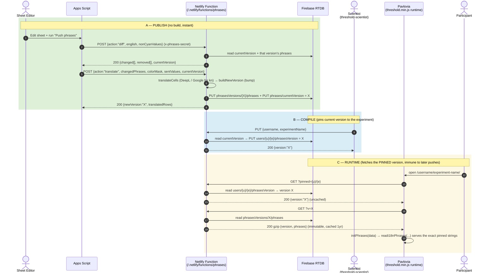
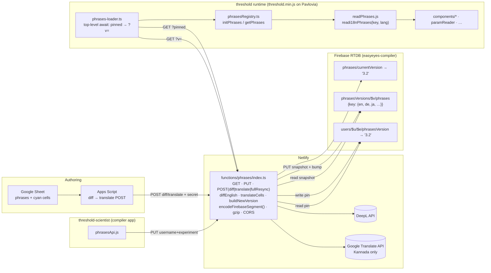
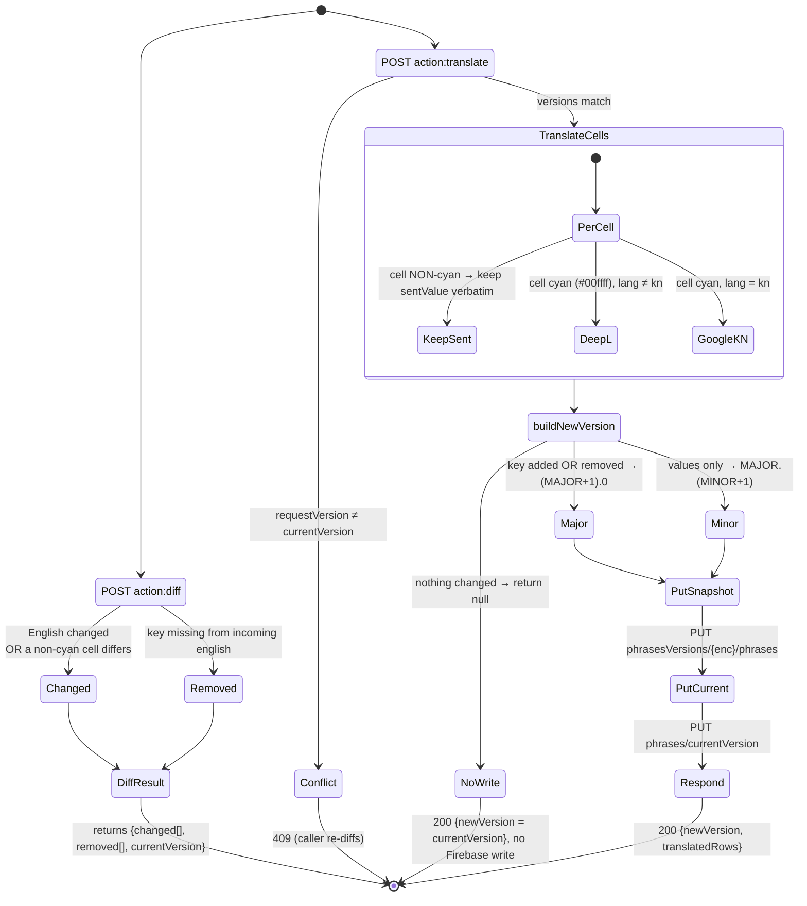
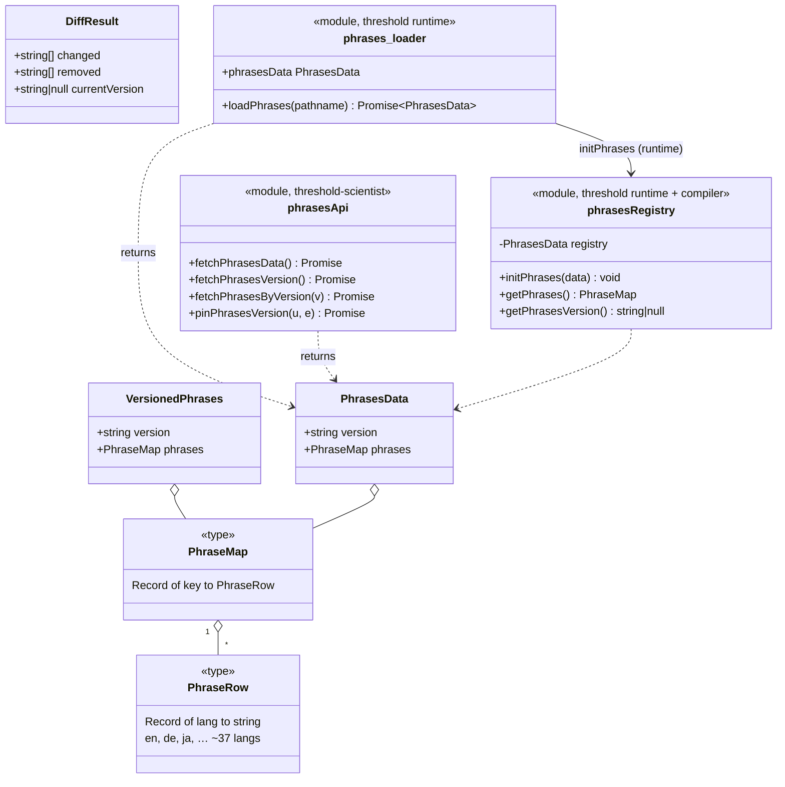

# Phrases Versioned API — Architecture

**Status:** Live (Netlify function `/.netlify/functions/phrases` + Firebase RTDB)
**Audience:** EasyEyes dev team
**Sibling doc:** [`GLOSSARY_VERSIONED_API_ARCHITECTURE.md`](./GLOSSARY_VERSIONED_API_ARCHITECTURE.md)

> **Read this if** you maintain, call, or debug the phrases endpoint. The phrases
> endpoint is the **glossary endpoint's sibling**: same versioned-snapshot-in-Firebase
> pattern, same pin-at-compile / fetch-pinned-at-runtime contract. It **adds**, on top
> of the glossary design:
>
> - **server-side translation** (DeepL, + Google Translate for Kannada) instead of
>   `GOOGLETRANSLATE` formulas in a sheet;
> - a **`diff` step** that publishes only what actually changed (cyan vs. non-cyan cells);
> - **gzip** on the payload responses;
> - a **shared-secret gate** on the write (`POST`) path.
>
> If a concept here (Firebase RTDB snapshots, `encodeFirebaseSegment`, CORS edge keying,
> the registry seam) feels under-explained, it is explained once in the glossary doc and
> not repeated.

---

## 1. TL;DR

Phrases (the UI strings shown to participants, in ~37 languages) used to be **baked into
the build**: a GitHub Action auto-translated a Google Sheet and committed `components/i18n.js`,
which then rode the Netlify build + CDN to participants. See [§6 History](#6-history-from-i18njs-to-the-endpoint).

The phrases endpoint makes them **versioned data, not committed code**:

- Phrases are stored as **immutable versioned JSON snapshots in Firebase RTDB**, served by
  a Netlify function as `application/json`.
- Publishing a change is a **`diff` → `translate` POST pair** to the function. `diff` finds
  the keys that genuinely changed; `translate` runs DeepL only on the cyan (auto-translate)
  cells, writes a **new version**, and bumps `currentVersion` — **no build, no commit**.
- Each compiled experiment **pins** the current version against its Pavlovia path. At runtime
  the experiment fetches **exactly that pinned version**, so a later phrases push can never
  silently alter a running study.

**Net effect:** phrases updates are live the moment the POST returns; the noisy auto-commit
pipeline and its no-review-gate failure modes are gone; and every experiment runs the exact
phrases it compiled against.

---

## 2. Architecture

### 2.1 Sequence — the three lanes



> **Caching, in one line:** `?v=` is immutable and cached for a year (the participant hot
> path); `?versionOnly=1`, `?pinned`, and every `POST` are `no-store` so the version probe
> can act as the freshness oracle. Payloads (`?v=` and bare current) are gzipped.

### 2.2 Component / deployment



### 2.3 Publish pipeline — diff → translate → bump

The new behavior versus the glossary endpoint, and the direct fix for the old pipeline's
noise. `diff` decides _what_ changed; `translate` decides _how each cell becomes its new
value_; `buildNewVersion` decides the _version number_ (and whether to write at all).



**The cyan rule (the heart of the noise fix).** Each cell carries a colour in `colorMask`.
A cell coloured cyan (`#00ffff`) is _machine-translatable_ — `translateCells` overwrites it
with DeepL output (Google for `kn`). Any other colour means a human owns that cell, so its
`sentValue` is written **verbatim, never machine-translated**. `diffEnglish` mirrors this:
a key counts as "changed" only when its English text changed **or** one of its _non-cyan_
(human-owned) values differs from what Firebase already has — so a stray re-evaluation of a
machine cell can no longer trigger a publish.

---

## 3. The contract — three layers

Producers and consumers agree on three stacked layers. A consumer only ever touches layers
2 and 3; the publish path (Apps Script) drives layer 1's write side.

```
  ┌─ Layer 1: HTTP API ─────────── GET ?v= / ?pinned= / ?versionOnly=1 · PUT pin · POST diff|translate
  │                                          │ (typed by)
  ├─ Layer 2: TypeScript types ─── VersionedPhrases / PhraseMap / PhrasesData / DiffResult
  │                                          │ (loaded into)
  ├─ Layer 3: registry seam ────── initPhrases(data) → getPhrases() / getPhrasesVersion()
  │                                          │ (read by)
  └─ Consumers ────────────────── readi18nPhrases(key, lang) · components/* · paramReader · …
```

### 3.1 Layer 1 — HTTP API

The full request/response matrix is in the [Appendix](#appendix--full-api-contract). The
shape a consumer cares about:

- **`GET ?pinned={u}/{e}`** → `{ version }` — resolve an experiment's pinned version (uncached).
- **`GET ?v={version}`** → gzip `{ version, phrases }` — the immutable payload (cached 1yr).
- **`PUT {username, experimentName}`** → `{ version }` — pin the current version at compile.

### 3.2 Layer 2 — the types both ends compile against



> `VersionedPhrases` (server-side, `functions/phrases/types.ts`) and `PhrasesData`
> (client-side, `source/components/types.ts`) are the **same wire shape** — `{ version,
phrases }` — declared once on each side of the network. Keep them in lockstep.

### 3.3 Layer 3 — the registry seam

`phrasesRegistry.ts` is the single in-memory boundary every downstream reader goes through,
so no consumer ever knows whether the data came from the network, a pinned version, or a test
fixture. `getPhrases()` **throws** if called before `initPhrases()` — in the runtime that
ordering is guaranteed by `phrases-loader.ts`'s top-level `await`.

```ts
let registry: PhrasesData | null = null;
export function initPhrases(data: PhrasesData): void {
  registry = data;
}
export function getPhrases() {
  if (registry === null)
    throw new Error("getPhrases() called before initPhrases()");
  return registry.phrases;
}
export function getPhrasesVersion(): string | null {
  return registry?.version ?? null;
}
```

---

## 4. Consumers — how to use it

### 4.1 threshold-scientist (compiler) — pin at compile time

```js
// source/components/phrasesApi.js
import { getEasyEyesBaseUrl } from "../../threshold/components/easyeyesBaseUrl";

export async function pinPhrasesVersion(username, experimentName) {
  const response = await fetch(
    `${await getEasyEyesBaseUrl()}/.netlify/functions/phrases`,
    {
      method: "PUT",
      headers: { "Content-Type": "application/json" },
      body: JSON.stringify({ username, experimentName }),
    },
  );
  return response.json(); // → { version }
}
```

Call it when an experiment compiles, so the experiment is frozen against the current version.

### 4.2 threshold runtime — load the pinned version at startup

```ts
// preprocess/phrases-loader.ts (trimmed — retry loop omitted)
export async function loadPhrases(pathname: string): Promise<PhrasesData> {
  const [username, experimentName] = pathname.split("/").filter(Boolean);
  const base = await getEasyEyesBaseUrl();

  // Step 1 — resolve the experiment's pinned version (uncached).
  const { version } = await (
    await fetch(
      `${base}/.netlify/functions/phrases?pinned=${username}/${experimentName}`,
    )
  ).json();

  // Step 2 — fetch the immutable payload for that exact version (cached forever).
  const data = (await (
    await fetch(`${base}/.netlify/functions/phrases?v=${version}`)
  ).json()) as PhrasesData;

  initPhrases(data); // populate the registry once
  return data;
}

// Runs at module load via top-level await, before any consumer imports phrasesData:
export const phrasesData: PhrasesData = await loadPhrases(
  window.location.pathname,
);
```

### 4.3 Reading a phrase anywhere downstream — the only pattern you need

```js
import { readi18nPhrases } from "./components/readPhrases";

// Per-language lookup (throws if the key or language is undefined):
const title = readi18nPhrases("EE_LanguageNativeName", "ja");

// Whole-row lookup (all languages for a key):
const row = readi18nPhrases("EE_ok"); // { en: "OK", de: "OK", … }
```

> ⚠️ **Order matters.** `readi18nPhrases` → `getPhrases()` throws before `initPhrases()`.
> In the runtime this is guaranteed by `phrases-loader`'s top-level await; elsewhere, run
> after the startup load resolves.

---

## 5. Pros & cons vs. the old `i18n.js` build pipeline

`who` = whom the effect lands on: **U** = users/scientists, **D** = dev team, **B** = both.

### Pros

| Pro                                 | who | Detail                                                                                                                                                                     |
| ----------------------------------- | --- | -------------------------------------------------------------------------------------------------------------------------------------------------------------------------- |
| **Instant publish, no build**       | B   | A push is live when the `translate` POST returns (seconds), vs ~10–14 min build + CDN.                                                                                     |
| **Review gate via `diff`**          | U   | `diff` reports exactly which keys changed before anything is written; no more blind auto-commits.                                                                          |
| **No dev-notes-shipped / GT-noise** | U   | Cyan rule + server-side DeepL replace in-sheet `GOOGLETRANSLATE`; non-cyan human cells are never machine-touched, and a re-evaluated machine cell can't trigger a publish. |
| **Reproducible pinned versions**    | B   | Each experiment runs the exact version it compiled with; later pushes can't change a running study.                                                                        |
| **Auto-versioning with semantics**  | D   | Key add/remove → major bump, value-only → minor; first push `1.0`; no-op publishes write nothing. No human picks the number.                                               |
| **No auto-commit churn**            | D   | Ends the ~1,200 automated `i18n.js` commits; phrases history lives in Firebase versions, not git.                                                                          |
| **gzip hot path**                   | U   | Participant `?v=` payload is gzipped and edge-cached for a year.                                                                                                           |
| **Typed, single-seam contract**     | D   | One `phrasesRegistry` seam for runtime and compiler; `{version, phrases}` wire shape declared once per side.                                                               |

### Cons / risks (verified against the code)

| Con                                           | who | Detail                                                                                                                                                                                                         |
| --------------------------------------------- | --- | -------------------------------------------------------------------------------------------------------------------------------------------------------------------------------------------------------------- |
| **Runtime fetch at bundle init**              | D   | The experiment now makes a blocking top-level-`await` fetch before it can run; the old build-baked `i18n.js` had none.                                                                                         |
| **Infinite retry can hang startup**           | B   | `phrases-loader.ts` uses `while (true)` with backoff and **no ceiling** — a participant whose fetch keeps failing hangs forever instead of seeing an error. (Same shape as the glossary loader's known issue.) |
| **PUT pin is unauthenticated**                | D   | Anyone can pin the _current_ version for any path. Harmless given the fallback, but an open write endpoint.                                                                                                    |
| **Translation latency & cost**                | D   | Publish now depends on DeepL (+ Google for `kn`) — external API latency, rate limits (429/456 retried 3×), and per-character cost.                                                                             |
| **More to operate**                           | D   | Firebase + Netlify + secrets (`FIREBASE_DB`, `PHRASES_SECRET`, `DEEPL_API_KEY`, `GOOGLE_API_KEY`) + CORS, vs a static committed file.                                                                          |
| **`threshold.min.js` still a build artifact** | D   | Loader _code_ changes (not phrases _content_) still require a build/deploy.                                                                                                                                    |

---

## 6. History — from `i18n.js` to the endpoint

Phrases used to live in a Google Sheet whose cells were auto-translated by the built-in
`GOOGLETRANSLATE` formula. A GitHub Action (`server/fetch-languages-sheets.mjs`) periodically
read the sheet, wrote `components/i18n.js`, and auto-committed it (`github action: update
phrases`), after which the normal Netlify build + CDN shipped the new strings to participants.

That pipeline had **no review gate**: it committed whatever the sheet currently returned.
The documented consequences — developer notes translated and shipped to users, non-deterministic
Google-Translate output churning commits, a single English edit retranslating hundreds of
unrelated keys, and ~1,200 of ~2,700 `i18n.js` commits being fully automated — are written up
in [`../../i18n-pipeline-investigation.md`](../../i18n-pipeline-investigation.md). The phrases
endpoint replaces this pipeline: the **cyan rule** stops machine translation from clobbering
human cells, **`diff`** suppresses the blast radius, **server-side DeepL** removes the in-sheet
formula noise, and **versioned snapshots + pinning** remove the build, the CDN wait, and the
auto-commit stream entirely.

---

## Appendix — full API contract

`/.netlify/functions/phrases`

| Method    | Query / body                                                                           | Returns                                                                          | Used by                        |
| --------- | -------------------------------------------------------------------------------------- | -------------------------------------------------------------------------------- | ------------------------------ |
| `GET`     | _(none)_                                                                               | `200` gzip `{version, phrases}` for current version (short cache + SWR)          | initial display                |
| `GET`     | `?versionOnly=1`                                                                       | `200 {version}` (no-store — the freshness oracle)                                | version probe                  |
| `GET`     | `?v={version}`                                                                         | `200` gzip `{version, phrases}` (immutable, 1yr); else `404 "Version not found"` | runtime hot path               |
| `GET`     | `?pinned={u}/{e}`                                                                      | `200 {version}` (no-store); `404 "No pinned version"`                            | `phrases-loader.ts` runtime    |
| `PUT`     | `{username, experimentName}`                                                           | `200 {version}` (pins current); `400` bad body; `500` no current version         | `phrasesApi.pinPhrasesVersion` |
| `POST`    | `{action:"diff", english, nonCyanValues?}` + `x-phrases-secret`                        | `200 {changed[], removed[], currentVersion}`                                     | Apps Script                    |
| `POST`    | `{action:"translate", changedPhrases, colorMask, sentValues, currentVersion}` + secret | `200 {newVersion, translatedRows}`; `409` version conflict; `400` >50 changed    | Apps Script                    |
| `POST`    | `{action:"fullResync", …}` + secret                                                    | same as `translate` but skips the 50-change size guard                           | Apps Script (bulk)             |
| `POST`    | any, missing/!= `PHRASES_SECRET`                                                       | `401 "Unauthorized"`                                                             | —                              |
| `OPTIONS` | —                                                                                      | `204` + CORS                                                                     | browsers                       |

**Error envelope.** Failures return `{ error: string }` with `Cache-Control: no-store`.
Unhandled exceptions return `503` (a controlled failure clients may retry), never Netlify's
opaque `502`.

**Firebase paths.** `phrases/currentVersion` (string), `phrasesVersions/{enc(version)}/phrases`
(the immutable snapshot), `users/{enc(u)}/{enc(e)}/phrasesVersion` (the per-experiment pin).
Segments are run through `encodeFirebaseSegment()` so keys containing `.`/`#`/`$`/`[`/`]`/`/`
are Firebase-safe; invalid phrase keys are dropped on write with a warning.

**Secrets / env.** `FIREBASE_DB` (admin auth on every Firebase call), `PHRASES_SECRET`
(gates `POST`), `DEEPL_API_KEY` (free vs. pro base URL auto-selected by `:fx` suffix),
`GOOGLE_API_KEY` (Kannada only; cells fall back to `sentValue` when absent).
